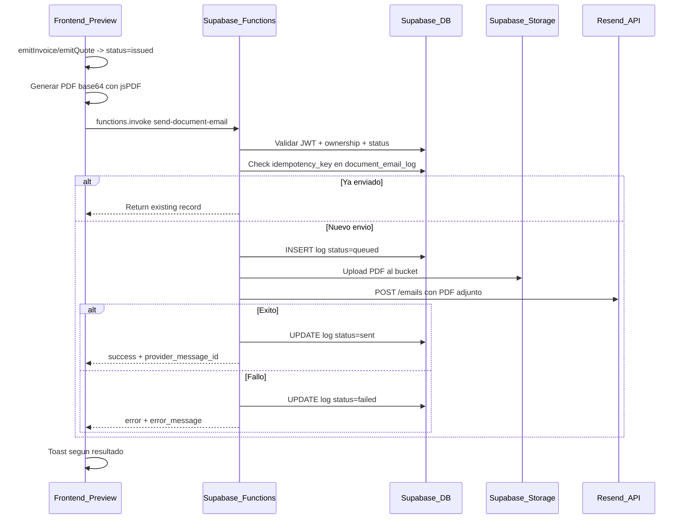

# Implementacion de envio de email con Supabase Edge Functions + Resend

## Arquitectura del flujo



---

## 1. Migracion SQL: tabla document_email_log + bucket Storage

**Archivo:** `supabase/migrations/20260213300000_create_document_email_log.sql`

Crear la tabla `document_email_log` con todos los campos especificados:

- `id` UUID PK, `user_id` UUID FK auth.users, `document_type` TEXT CHECK (invoice, quote), `document_id` UUID, `to_email` TEXT NOT NULL, `subject` TEXT, `provider` TEXT DEFAULT 'resend', `provider_message_id` TEXT, `status` TEXT CHECK (queued, sent, failed), `error_message` TEXT, `attempt_count` INT DEFAULT 1, `idempotency_key` TEXT UNIQUE, `created_at` TIMESTAMPTZ DEFAULT NOW(), `sent_at` TIMESTAMPTZ

Indices:

- `idx_email_log_user_id`, `idx_email_log_document`, `idx_email_log_idempotency`

RLS:

- SELECT: `user_id = auth.uid()`
- INSERT: `user_id = auth.uid()`
- UPDATE: `user_id = auth.uid()`
- No DELETE (logs son inmutables)

Bucket de Storage via SQL:

- `INSERT INTO storage.buckets (id, name, public) VALUES ('document-pdfs', 'document-pdfs', false)`
- Politica de Storage: solo el owner puede leer/escribir sus PDFs (`auth.uid()::text = (storage.foldername(name))[1]`)

---

## 2. Edge Function: send-document-email

**Archivo:** `supabase/functions/send-document-email/index.ts`

Funcion Deno que:

1. **Parsea request**: extrae `documentType`, `documentId`, `to`, `subject`, `body`, `pdfBase64`, `pdfFilename`
2. **Valida JWT**: `supabaseClient.auth.getUser()` con el token del header Authorization
3. **Verifica ownership**: consulta `invoices` o `quotes` segun `documentType`, comprueba `user_id` y `status = 'issued'`
4. **Calcula idempotency_key**: `SHA-256(documentType + documentId + to)`  

(Sin pdfHash para que un reenvio al mismo destinatario del mismo documento sea idempotente)

5. **Check duplicado**: consulta `document_email_log` por `idempotency_key`. Si existe con `status = 'sent'`, retorna el registro existente sin reenviar
6. **Inserta log** con `status = 'queued'`
7. **Sube PDF a Storage**: ruta `{user_id}/{documentType}/{documentId}/{pdfFilename}`
8. **Construye email HTML** profesional sencillo con nombre del negocio (del issuer en invoice_data/quote_data)
9. **Envia via Resend**: `POST https://api.resend.com/emails` con:

   - `from`: secret `RESEND_FROM`
   - `to`: email del cliente
   - `subject`: "Factura F2026-001 de [Nombre Negocio]" (o custom si se envio)
   - `html`: plantilla HTML profesional
   - `attachments`: [{filename, content: pdfBase64}]
   - `reply_to`: secret `MAIL_REPLY_TO` (opcional)

10. **Actualiza log**: `status = 'sent'` + `provider_message_id` + `sent_at`, o `status = 'failed'` + `error_message`
11. **Retorna** resultado al frontend

Secrets necesarios (a configurar manualmente en Supabase Dashboard o CLI):

- `RESEND_API_KEY`
- `RESEND_FROM` (ej: `Facturaldigital <noreply@tudominio.com>`)
- `MAIL_REPLY_TO` (opcional)

---

## 3. Cambios en frontend: preview.html (facturas)

**Archivo:** [invoices/preview.html](invoices/preview.html)

Modificar `confirmEmitInvoice(sendEmail)`:

```javascript
async function confirmEmitInvoice(sendEmail) {
  closeEmitModal();
  // ... emit logic existente ...
  var result = await window.emitInvoice(currentInvoiceId);
  if (!result.success) { /* error */ return; }
  
  if (sendEmail) {
    // Obtener email del cliente
    var clientEmail = currentInvoiceData.client?.email;
    if (!clientEmail) {
      showToast('Factura emitida. No se pudo enviar email: el cliente no tiene email.', 'warning');
    } else {
      // Obtener PDF en base64
      var pdfBase64 = pdfGenerator.doc.output('base64');
      var pdfFilename = 'factura_' + (currentInvoiceData.invoice?.number || 'doc') + '.pdf';
      var issuerName = currentInvoiceData.issuer?.name || '';
      var subject = 'Factura ' + (currentInvoiceData.invoice?.number || '') + ' de ' + issuerName;
      
      // Llamar Edge Function
      var emailResult = await sendDocumentEmail({
        documentType: 'invoice',
        documentId: currentInvoiceId,
        to: clientEmail,
        subject: subject,
        pdfBase64: pdfBase64,
        pdfFilename: pdfFilename
      });
      
      if (emailResult.success) {
        showToast('Factura emitida y enviada por email', 'success');
      } else {
        showToast('Factura emitida. Error al enviar email: ' + (emailResult.error || ''), 'error');
      }
    }
  } else {
    showToast('Factura emitida correctamente', 'success');
  }
  // ... redirect ...
}
```

---

## 4. Cambios en frontend: quote-preview.html (presupuestos)

**Archivo:** [invoices/quote-preview.html](invoices/quote-preview.html)

Modificar `confirmEmitQuote(sendEmail)` con la misma logica adaptada:

- `documentType: 'quote'`
- `subject: 'Presupuesto ' + number + ' de ' + issuerName`
- `pdfFilename: 'presupuesto_' + number + '.pdf'`

---

## 5. Helper global: sendDocumentEmail()

**Archivo:** [assets/js/invoices.js](assets/js/invoices.js) (o nuevo archivo `assets/js/email-sender.js`)

Funcion reutilizable que encapsula la llamada a la Edge Function:

```javascript
async function sendDocumentEmail(payload) {
  try {
    var supabase = window.supabaseClient;
    var { data, error } = await supabase.functions.invoke('send-document-email', {
      body: payload
    });
    if (error) throw error;
    return { success: true, data: data };
  } catch (e) {
    return { success: false, error: e.message };
  }
}
window.sendDocumentEmail = sendDocumentEmail;
```

Se recomienda crearlo como archivo separado `assets/js/email-sender.js` y cargarlo en preview.html y quote-preview.html, para mantener separacion de responsabilidades.

---

## 6. Plantilla HTML del email

La Edge Function incluira una plantilla HTML inline sencilla y profesional:

- Header con nombre del negocio (extraido de invoice_data.issuer.name via consulta DB)
- Texto: "Estimado/a [nombre_cliente], adjuntamos su factura/presupuesto No [numero]."
- Importe total
- Nota al pie con texto legal generico
- Sin imagenes externas (compatibilidad maxima con clientes de correo)

---

## Archivos a crear/modificar

| Accion | Archivo |

|--------|---------|

| Crear | `supabase/migrations/20260213300000_create_document_email_log.sql` |

| Crear | `supabase/functions/send-document-email/index.ts` |

| Crear | `assets/js/email-sender.js` |

| Modificar | `invoices/preview.html` (confirmEmitInvoice + cargar email-sender.js) |

| Modificar | `invoices/quote-preview.html` (confirmEmitQuote + cargar email-sender.js) |

---

## Configuracion manual necesaria (fuera del codigo)

1. Configurar secrets en Supabase: `RESEND_API_KEY`, `RESEND_FROM`, `MAIL_REPLY_TO`
2. Desplegar Edge Function: `supabase functions deploy send-document-email`
3. Ejecutar la migracion SQL
4. Verificar dominio en Resend (si se usa dominio propio)