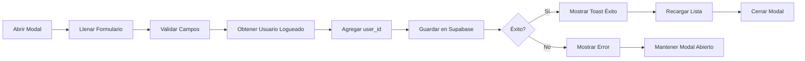
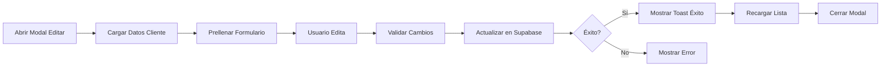

# 📋 Modal de Cliente - Guía de Uso

## Descripción

El modal de cliente es un componente unificado y mejorado para crear y editar clientes en toda la aplicación. Se usa tanto en la página de gestión de clientes (`users.html`) como en la creación de facturas (`invoices/new.html`).

## Características

### Diseño Mejorado
- ✅ **Centrado perfecto**: Vertical y horizontalmente
- ✅ **Ancho amplio**: 896px (max-w-4xl) para mayor comodidad
- ✅ **Grid 2 columnas**: Organización clara de campos
- ✅ **Responsive**: Se adapta a móviles (1 columna en pantallas pequeñas)
- ✅ **Dark mode**: Soporte completo para modo oscuro

### Validaciones
- ✅ **Campos obligatorios**: Nombre y NIF/CIF marcados con asterisco rojo
- ✅ **Validación de email**: Formato válido
- ✅ **Validación de teléfono**: Formato válido
- ✅ **Validación en tiempo real**: Al salir del campo (blur)
- ✅ **Mensajes de error**: Bajo cada campo con problema
- ✅ **Prevención de doble submit**: Botón deshabilitado durante guardado

### UX Mejorada
- ✅ **Animaciones suaves**: Fade in/out y slide
- ✅ **Estados de carga**: Spinner en botón durante guardado
- ✅ **Focus automático**: Primer campo recibe focus al abrir
- ✅ **Cerrar con ESC**: Tecla Escape cierra el modal
- ✅ **Cerrar con overlay**: Click fuera del modal lo cierra
- ✅ **Toast notifications**: Mensajes de éxito/error
- ✅ **Limpieza automática**: Formulario se resetea al cerrar

### Seguridad
- ✅ **user_id automático**: Se asigna el usuario logueado
- ✅ **RLS por usuario**: Cada usuario solo ve sus clientes
- ✅ **Validación backend**: Supabase valida los datos
- ✅ **Sanitización**: Datos se limpian antes de guardar

## Uso en users.html

### Abrir Modal para Crear

```javascript
window.openCreateClientModal();
```

### Abrir Modal para Editar

```javascript
window.openEditClientModal(clientId);
```

### Cerrar Modal

```javascript
window.closeClientModal();
```

## Uso en invoices/new.html

### Abrir Modal para Crear

```javascript
window.openInvoiceCreateClientModal();
```

### Cerrar Modal

```javascript
window.closeInvoiceCreateClientModal();
```

### Auto-Selección

Cuando se crea un cliente desde la página de facturas:
1. Se guarda en Supabase
2. Se auto-selecciona automáticamente
3. Se rellenan los campos de la factura
4. Se cierra el modal

## Campos del Formulario

### Obligatorios (*)
- **Nombre / Razón Social**: Nombre completo o razón social del cliente
- **NIF / CIF**: Identificador fiscal (único)

### Opcionales
- **Email**: Email de contacto (validado)
- **Teléfono**: Teléfono de contacto
- **Dirección**: Dirección completa
- **Código Postal**: Código postal
- **Ciudad**: Ciudad
- **País**: País
- **Día de Facturación**: Día del mes preferido (1-31)
- **Estado**: Activo o Inactivo

## IDs de los Campos

### En users.html
- `client-id` (hidden)
- `client-name`
- `client-taxid`
- `client-email`
- `client-phone`
- `client-address`
- `client-postal-code`
- `client-city`
- `client-country`
- `client-billing-day`
- `client-status`

### En invoices/new.html
- `new-client-name`
- `new-client-nif`
- `new-client-email`
- `new-client-phone`
- `new-client-address`
- `new-client-postal`
- `new-client-city`
- `new-client-country`
- `new-client-billing-day`
- `new-client-status`

## Flujo de Funcionamiento

### Modo Crear



### Modo Editar



## Validaciones Implementadas

### Nombre / Razón Social
- No puede estar vacío
- Se muestra con borde rojo si falla

### NIF / CIF
- No puede estar vacío
- Se convierte a mayúsculas automáticamente
- Debe ser único en la base de datos

### Email
- Opcional
- Si se proporciona, debe tener formato válido (ejemplo@dominio.com)
- Se valida con regex

### Teléfono
- Opcional
- Si se proporciona, debe tener formato válido
- Acepta: +34 600 000 000, 600000000, +34600000000

### Día de Facturación
- Opcional
- Debe estar entre 1 y 31
- Valor por defecto: 30

## Manejo de Errores

### Errores de Validación
- Se muestran bajo el campo específico
- El campo se marca con borde rojo
- El formulario no se envía

### Errores de Supabase
- **Identificador duplicado**: "Ya existe un cliente con ese identificador"
- **Sin autenticación**: "Usuario no autenticado. Por favor, inicia sesión."
- **Sin permisos RLS**: "No tienes permisos para realizar esta acción"
- **Error genérico**: Se muestra el mensaje del error

### Errores de Red
- Se capturan y se muestra: "Error inesperado al guardar el cliente"
- Se registran en consola para debugging

## Eventos del Modal

### Abrir
- Se limpia el formulario
- Se limpian errores anteriores
- Se establece el modo (crear/editar)
- Se hace focus en el primer campo
- Se añade animación de entrada

### Cerrar
- Se añade animación de salida
- Se limpia el formulario
- Se resetea el estado
- Se ejecuta callback `onClose` si existe

### Guardar
- Se previene submit por defecto
- Se deshabilita el botón
- Se validan todos los campos
- Se obtiene user_id del usuario logueado
- Se envía a Supabase
- Se muestra resultado (toast)
- Se ejecuta callback `onSave` con datos del cliente
- Se cierra el modal

## Personalización

### Clase ClienteModal

Puedes crear una instancia personalizada:

```javascript
const miModal = new ClienteModal('mi-modal-id', {
  onSave: (cliente) => {
    console.log('Cliente guardado:', cliente);
    // Tu lógica personalizada
  },
  onClose: () => {
    console.log('Modal cerrado');
  }
});

// Abrir en modo crear
miModal.open('create');

// Abrir en modo editar
miModal.open('edit', clientId);
```

## Troubleshooting

### El modal no se abre
- Verificar que el ID del modal es correcto
- Verificar en consola si hay errores de JavaScript
- Verificar que los scripts están cargados en el orden correcto

### El botón guardar no funciona
- Verificar que hay un form con ID `client-form` o `invoice-client-form`
- Verificar que el event listener está conectado
- Ver errores en consola del navegador

### Los campos no se llenan al editar
- Verificar que el cliente se carga correctamente
- Ver red tab en DevTools para la request a Supabase
- Verificar que los IDs de los campos coinciden

### user_id no se asigna
- Verificar que el usuario está autenticado
- Ver consola para errores de auth
- Verificar que la migración de user_id se aplicó

## Testing

Ver archivo `TESTING_SUPABASE.md` para checklist completo de testing del modal.

## Soporte

- **Documentación completa**: `SUPABASE_SETUP.md`
- **Testing**: `TESTING_SUPABASE.md`
- **Migraciones**: `INSTRUCCIONES_MIGRACIONES.md`
- **RLS**: `INSTRUCCIONES_RLS.md`

---

**Última actualización**: 29 de enero de 2026
