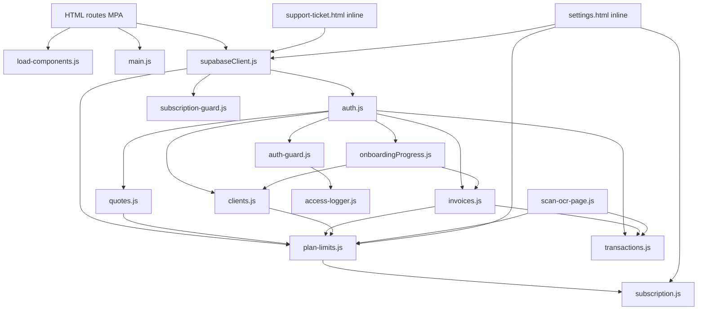

# Dependency Map (F0/F2)

- Fecha: 10 de marzo de 2026
- Base: analisis estatico + revision manual de modulos transversales y de dominio

## 1) Mapa macro de dependencias legacy

## 2) Modulos legacy y dependencias directas

### 2.1 Plataforma/shell

- `assets/js/load-components.js`
  - Depende de: `fetch` layout HTML, `localStorage`, `global-search.js`.
  - Consumido por: paginas protegidas legacy.
- `assets/js/main.js`
  - Depende de: jQuery, DOM global, theme/local/session storage.
  - Consumido por: shell y paginas con widgets legacy.

### 2.2 Autenticacion y acceso

- `assets/js/supabaseClient.js`
  - Provee: `window.supabaseClient`, `window.supabaseAuthReady`.
  - Consumidores: practicamente todo modulo con datos.
- `assets/js/auth.js`
  - Provee: `window.auth` + funciones globales (`signIn`, `checkAuth`, etc.).
  - Consumidores: signin/signup/guards/settings/reset.
- `assets/js/auth-guard.js`
  - Depende de: `window.checkAuth`, `window.supabaseAuthReady`.
  - Side effect: inyecta `access-logger.js`.

### 2.3 Billing y limites

- `assets/js/subscription.js`
  - Provee: `window.subscriptionHelper`.
  - Dependencias: `billing_subscriptions`.
- `assets/js/plan-limits.js`
  - Provee: `window.planLimits`.
  - Dependencias: `billing_subscriptions`, `billing_usage`, RPC `increment_billing_usage`.
  - Consumidores: clientes/productos/facturas/presupuestos/OCR/settings.

### 2.4 Dominio core

- `assets/js/clients.js`
  - Depende de: Supabase + `window.planLimits` + `window.updateStepProgress`.
- `assets/js/transactions.js`
  - Depende de: Supabase + `window.getClientById`.
- `assets/js/invoices.js`
  - Depende de: Supabase + `window.planLimits` + onboarding.
  - Side effect clave: crea/elimina transaccion por `invoice_id` al pagar/despagar.
- `assets/js/quotes.js`
  - Depende de: Supabase + `window.planLimits`.
  - Anomalia: reutiliza contador de facturas (`canCreateInvoice`, `recordInvoiceUsage`).
- `assets/js/onboardingProgress.js`
  - Depende de: Supabase + auth global.
  - Consumido por: home/index, expenses, scan-ocr, settings, clients, invoices.

### 2.5 Superficies secundarias con alto acoplamiento

- `scan-ocr-page.js`: storage + edge function `analyze-expense-document` + transacciones + plan limits.
- `support-ticket.html` inline: Quill + edge function `send-support-ticket`.
- `settings.html` inline: billing completo, plan usage, series, seguridad, access logs, equipo local.

## 3) Dependencias ocultas de negocio (confirmadas)

1. Factura pagada crea transaccion automatica en `transacciones` (`invoice_id`).
2. Factura no pagada elimina transaccion automatica asociada.
3. Presupuestos consumen cuota/uso de facturas (decision no resuelta de politica).
4. Compatibilidad legacy facturas/presupuestos sin `client_id` depende de fallback por NIF/nombre (migracion SQL existente).
5. Onboarding se actualiza desde eventos de negocio (crear cliente, personalizar factura, emitir factura).

## 4) Orden sugerido de desacoplamiento por riesgo

1. `supabaseClient/auth/guards` (estabilizar contrato de sesion y acceso).
2. `plan-limits + subscription` (evitar regresiones de cuota y bloqueos).
3. repositorios tipados (`clients`, `transactions`, `products`, `invoices`, `quotes`).
4. onboarding y access-log como servicios de side effects.
5. shell legacy (`load-components` + `main`) para eliminar reinyectado de listeners.
6. nucleo documental shared (antes de migrar pantallas completas de facturas/presupuestos).

## 5) Estado tras F1/F2 en este repo

- Ya existe una base de servicios/repositories en `src/services/*`.
- Ya existe namespace de transicion `window.facturalesServices.*` enlazado desde modulos legacy nucleares.
- Se preserva backward compatibility: `window.*` legacy sigue operativo en paralelo.
- Existe shell React aislado en `src/app/*` sin dependencia de `load-components.js` ni `componentsLoaded`.
- Existe ruta piloto `pilot-products.html` conectada por adaptador de navegacion desde `productos.html`.
- Se explicitaron reglas criticas de dominio en `src/domain/rules/*` para soportar regresion tests.
